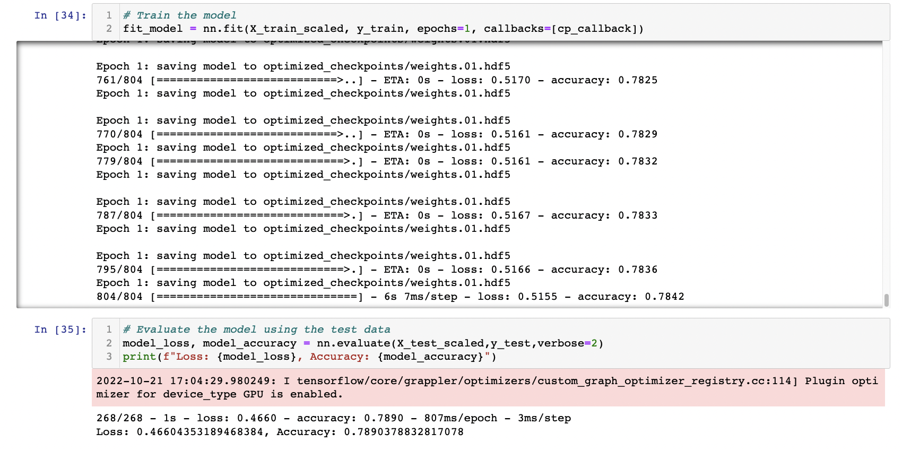

# Neural_Network_Charity_Analysis

## Project Overview
The purpose of this project was to use DeepLearning to create a binary classifier capable of predicting whether applicants will effectively use funds given by the company Alphabet Soup. This dataset contains over 34,000 organizations that have been funded by Alphabet Soup over the years along with data regarding the application type, affiliated sector or industry, government organization classification, use case for funding, organization type, active status, income classification, special consideration for application, and funding amount requested. In addition, the dataset contains data regarding whether or not these organizations used the funds effecitvely.

In order to create a binary classifier capable of predicting which applicants will effectivelty use funds from Alphabet soup I performed the following tasks:

- Deliverable 1: Preprocessed Data for a Neural Network Model

- Deliverable 2: Compiled, Trained, and Evaluated the Model

- Deliverable 3: Optimized the Model to Atleast 75% Accuracy

## Resources
[AlphabetSoupCharity.ipynb](AlphabetSoupCharity.ipynb) - A Jupyter Notebook that contains the initial preprocessing, training, and evaluation of the neural network model.

[AlphabetSoupCharity.h5](AlphabetSoupCharity.h5) - An HDF5 file that allows the original trained model to be imported for future used.

[AlphabetSoupCharity_Optimzation.ipynb](AlphabetSoupCharity_Optimzation.ipynb) - A Jupyter Notebook where the neural network model was optimized.

[AlphabetSoupCharity_Optimized.h5](AlphabetSoupCharity_Optimized.h5) - An HDF5 file that allows the original trained model to be imported for future used.

[charity_data.csv](Resources/charity_data.csv) - Contains the raw data used to generate the model.

## Results
### Data Preprocessing
- The target for the model was the following column:
    - "IS_SUCCESSFUL": Indicates whether or not a company used funding effectively.

- The features of the model were the following columns:
    - "NAME": Indicates which organization applied for funding
    - "APPLICATION_TYPE": Indicates the type of application
    - "CLASSIFICATION": Indicates the government organization classification
    - "USE_CASE": Indicates the use case for funding
    - "ORGANIZATION": Indicates the type of organization that applied
    - "STATUS": Indicates whether the application is active or not
    - "INCOME_AMT": Indicates the income classification 
    - "SPECIAL_CONSIDERATIONS": Indicates if there was a special consideration for the application
    - "ASK_AMT": Indicates the funding amount requested

- The "EIN" column was removed as a feature as it indicates a unique identifier for each application and its removal did not significantly impact the model.
- It is also important to note that in the original model I had removed the "NAME" column. This column contains information that aids the predictive capabilities of the neural network. This is likely due to the fact that many organizations have received or attempted to receive funding from Alphabet Soup over the years. The absence of this column leads the model to have only ~72% accuracy while its reintroduction increases accuracy above 75%. This increase may be due to the fact that knowledge of an organization's past success (or failure) could be helpful in predicting future success (or failure).

### Compiling, Training, and Evaluating the Model
In the original model I used an input layer with a ReLU activation function, two hidden layers, both with ReLU activation functions and 80 and 30 neurons respecively, as well as a single output layer with a sigmoid activation function. ReLU  is known to facilitate ease of training and typically achieves high performance (https://machinelearningmastery.com/rectified-linear-activation-function-for-deep-learning-neural-networks/), therefore I choose the ReLU  activation as my goto function for input and hidden layers. Since we are dealing with a binary classification problem, I choose the sigmoid function as my output layer since it maps real numbers to a probability between 0 and 1 (https://www.educative.io/answers/what-is-sigmoid-and-its-role-in-logistic-regression). 

For optimization purposes, I did try other activation functions for each of the layers. I observed that changes of the input or hidden layers from ReLU  to other linear activation functions did not lead to reproducible increases in model performance while changing them to non-linear functions such as sigmoid led to a decrease in model performance. In addition, changing the output layer activation function from sigmoid to a linear functions such as ReLU  led to significant reductions in model performance. Based on these preliminary data, I choose to keep my input and hidden layers as ReLU and the output function as sigmoid.

In addition, I also adjusted the number of neurons in my hidden layers. According to a stackover flow post on choosing the number of neurons and hidden layers (https://stats.stackexchange.com/questions/181/how-to-choose-the-number-of-hidden-layers-and-nodes-in-a-feedforward-neural-netw), they suggest that only a single hidden layer is necessary in most cases and that the number of neurons choosen for the first hidden layer should be the sum of the total number of input features + the output layer inputs divided by 2. Since the length of X_train + my output was 838+1, I used 420 neurons for my first layer. This led to a small but significant improvement in model performance. I then tried adding additional layers where the number of neurons were half of the previous layer. I found that the addition of two hidden layers was ideal and that anything after this did not appreciably increase model performance.

**Optimized Single Layer Performance**
 

**Optimized Two Layer Performance**
 

**Optimized Three Layer Performance**
 

## Summary
In conclusion, the neural network model presented here provides significant predictive capabilities (~79.5% accuracy) in determing which companies will use funding from Alphabet Soup effectively. While this dataset was sufficiently large to employ DeepLearning, it may also be small enough for traditional machine learning models to evaluate effectively. It would likely be a good idea to try using classical machine learning models focused on logistic regression to determine how well they predict outcomes for this dataset. Since, these models are less GPU intensive, it's possible similar performance could be acheived more rapidly.  